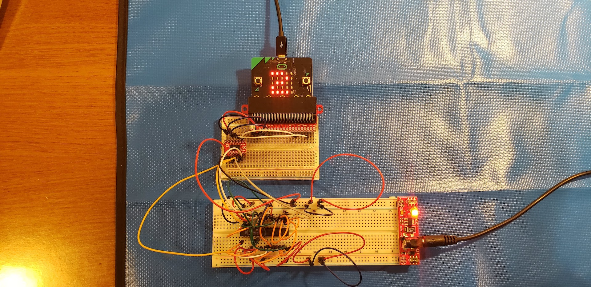

# CPE 1040 - Spring 2020

Author: Ivo Georgiev, PhD  
Last updated: 2020-05-16   
Code: 9acff7cc344309ac25976869a50535751d4b970d      



This is lesson and assignment 007 for the Spring 2020 installment of the CPE 1040 - Intro to Computer Engineering course at MSU Denver.

Table of Contents
=================

* [CPE 1040 \- Spring 2020](#cpe-1040---spring-2020)
  * [Take\-home lab kit](#take-home-lab-kit)
  * [Lesson &amp; Assignment 007: Logic gates](#lesson--assignment-007-logic-gates)
    * [Section 1: AND, OR, and NOT gates from NPN transistors](#section-1-and-or-and-not-gates-from-npn-transistors)
      * [1\. Study](#1-study)
        * [Logic levels](#logic-levels)
        * [Logical functions](#logical-functions)
        * [Boolean algebra](#boolean-algebra)
        * [Truth tables](#truth-tables)
          * [Notation](#notation)
        * [Logic gate internals](#logic-gate-internals)
      * [2\. Apply](#2-apply)
      * [3\. Present](#3-present)
    * [Section 2: Drive and read NPN\-transistor\-based gates with the micro:bit](#section-2-drive-and-read-npn-transistor-based-gates-with-the-microbit)
      * [1\. Study](#1-study-1)
      * [2\. Apply](#2-apply-1)
      * [3\. Present](#3-present-1)
    * [Section 3: Logic gate ICs](#section-3-logic-gate-ics)
      * [1\. Study](#1-study-2)
        * [Logic gates in the lab kit](#logic-gates-in-the-lab-kit)
        * [Reading the datasheets](#reading-the-datasheets)
        * [The underlying circuits](#the-underlying-circuits)
        * [Correct placement](#correct-placement)
      * [2\. Apply](#2-apply-2)
      * [3\. Present](#3-present-2)
    * [Section 4: Combinational logic](#section-4-combinational-logic)
      * [1\. Study](#1-study-3)
        * [Boolean algebra, logic gates, and truth tables](#boolean-algebra-logic-gates-and-truth-tables)
        * [Functional sets](#functional-sets)
        * [Combinational logic](#combinational-logic)
      * [2\. Apply](#2-apply-3)
      * [3\. Present](#3-present-3)
    * [Section 5: Logic analyzer on the micro:bit](#section-5-logic-analyzer-on-the-microbit)
      * [1\. Study](#1-study-4)
        * [Multi\-input gates](#multi-input-gates)
        * [Truth table as functional definition of an arbitrary combinational circuit](#truth-table-as-functional-definition-of-an-arbitrary-combinational-circuit)
      * [2\. Apply](#2-apply-4)
      * [3\. Present](#3-present-4)
    * [Section 6: Bi\-directional binary ripple counter (asynchronous)](#section-6-bi-directional-binary-ripple-counter-asynchronous)
      * [1\. Study](#1-study-5)
      * [2\. Apply](#2-apply-5)
      * [3\. Present](#3-present-5)
    * [Section 7: Bi\-directional synchronous circuits (IN PROGRESS)](#section-7-bi-directional-synchronous-circuits-in-progress)
      * [1\. Study](#1-study-6)
      * [2\. Apply](#2-apply-6)
      * [3\. Present](#3-present-6)
    * [Section 8: Synchronous modulo counters (IN PROGRESS)](#section-8-synchronous-modulo-counters-in-progress)
      * [1\. Study](#1-study-7)
      * [2\. Apply](#2-apply-7)
      * [3\. Present](#3-present-7)
  * [Resources](#resources)
    * [micro:bit](#microbit)
    * [Transistors](#transistors)
      * [Transistor datasheets](#transistor-datasheets)
    * [Logic gates](#logic-gates)
      * [Logic gate datasheets](#logic-gate-datasheets)
    * [Flip\-flops](#flip-flops)
      * [Flip\-flop datasheets](#flip-flop-datasheets)
    * [Capacitors](#capacitors)
    * [Sensors](#sensors)
    * [Logic level converter](#logic-level-converter)
    * [Oscilloscopes](#oscilloscopes)
    * [Github](#github)
    * [JavaScript](#javascript)

**NOTE:** 
1. This lesson & assignment [README](README.md) is _intentionally_ blank, to be used as the **Lab Notebook** for the study & submission. _It is a great aid for your study and the main component of your submission._
2. Read and follow the [lesson-and-assignment](lesson-and-assignment.md).
2. Refer to the [submission template](submission-template.md) for formatting expectations and examples. 
4. Refer to the [criteria and guide](criteria-and-guide.md) for the different components of your submission.

## Take-home lab kit

The take-home lab kit is meant to provide continuity of our lab projects across the transition to online instruction. Please, read the [BOM, guide, and care document](https://docs.google.com/document/d/18IDsrQlZY_QkmWG7FFtGqd9M2S1wL8ShJrD00aHwBwQ/edit?usp=sharing) and use it as a reference throughout the lesson and assignment.

## Lesson & Assignment 007: Logic gates

This is a lesson and assignment on _logic gates_. Logic gates are circuits which apply logical functions on their inputs and output the result. Logic gates can have 1 or more inputs but usually have only 1 output. They are the building blocks of modern computational hardware, including arithmetic, logic, and control circuits. The logic gates themselves are built out of transistors.

### Section 1: AND, OR, and NOT gates from NPN transistors

#### 1. Study

##### Logic levels
Logic gates are the crucial layer in the _hardware stack_ of a computer, in which continuous voltages are _discretized and abstracted_ into the 1s and 0s that represent _binary numbers_. While logic gates are implemented via complex _transistor-transistor logic_ or _diode-transistor logic_, their function is simple and can be understood in terms of just _functions of 0s and 1s_.

On the electrical level, _logic low_, commonly designated as `0`, is usually taken to be 0V or _ground_ (which is the common reference volgate for the whole circuit), and _logic high_, commonly designated at `1`, is the highest voltage at which the circuit operates. Common logic-high voltages in electronics are 3.3V and 5V. Other values in the range 1V-12V are less common.

The continuous voltage range between _logic low_ and _logic high_ is usually divided in 3 distinct bands:
- _logic low_: [0V, V<sup>low</sup><sub>max</sub>];
- intermediate forbidden: [V<sup>low</sup><sub>max</sub>, V<sup>high</sup><sub>min</sub>];
- _logic high_: [V<sup>high</sup><sub>min</sub>, V<sup>high</sup><sub>max</sub>], where V<sup>high</sup><sub>max</sub> is either 3.3V or 5V.

The intermediate band serves as a buffer, simplifying the recognition circuitry and filtering noise. The simplicity of dividing the voltage range into only 3 bands is also one of the chief advantages of _binary_ as the fundamental number system of computing.
   
##### Logical functions
Logic gates perform _functions_ (relations between input and output signals, in which there is a _single_ output for every _combination of outputs_) on signals that can take one of two values: _logic low_ (aka `0`, or `False`) and _logic high_ (aka `1`, or `True`). In other words, logical functions have the same _domain_ and _range_, equal to the discrete set of `{0, 1}`. (_Note that this is the notation for a **discrete** range. In our case, it consists of the set of numbers 0 and 1, and no others. **Continuous** ranges are represented with the following notation: `[0, 1)` (real-number interval, half-open on the right, including all real numbers between 0.0 and 1.0, excluding 1.0), `(0, 1]`, and `[0, 1]`._) Once we start talking about logic gates and design more complex computational circuits out of them, we forget about voltages, currents, and impedances. Thus, logic gates bridge the _electrical layer_ and the _logical layer_ in the _computer stack_.

The inputs of logic gates are all the combinations of the number of inputs, where each input is in the range `{0, 1}`. For example, a 2-input gate will have the following 4 possible different inputs: `00`, `01`, `10`, and `11`. What this means is that, if we designate the 2 inputs "A" and "B", the input combinations are all of the form "AB". (_Note that here we use the term "combinations" in a mathematically imprecise way, as what we are talking about are actually "permutations". For example, `10` and `01` are **distinct permutations** whereas they represent the **same combination**. That is, order matters for permutations and does not matter for combinations. Since we want the two inputs `10` and `01` to be distinct, we are really talking about permutations._) The single output of the 2-input gate is in the range `{0, 1}`.

##### Boolean algebra
An _algebra_ is a system of rules for the manipulation of a certain _set of mathematical entities_. By this definition, [_Boolean algebra_](https://mathworld.wolfram.com/BooleanAlgebra.html) is the algebra of the two-valued set `{0, 1}`. Mathematically, it is a _ring_, closed under the _meet_ (aka _AND_) and _join_ (aka _OR_) operations, and its two _literals_ are `0` and `1`, which are inverse of each other. Boolean algebra greatly simplifies the understanding, design, and verification of electronic circuits.

##### Truth tables
Because they are discrete-valued, with the only two values `0` and `1`, logic functions can very conveniently be represented as _truth tables_, which are exhaustive and explicit representation of the functional relationship between inputs and outputs. In fact, truth tables are used to _define_ the logic functions themselves. Here is a sampling:

A | B | /A (aka NOT) | AB (aka AND) | A+B (aka OR) | /(A+B) (aka NAND)
--- | --- | --- | --- | --- | ---
0 | 0 | 1 | 0 | 0 | 1
0 | 1 | 1 | 0 | 1 | 1
1 | 0 | 0 | 0 | 1 | 1
1 | 1 | 0 | 1 | 1 | 0    

###### Notation                                          
The symbol /A is equivalent to "A-bar" as in 
```
_
A
```
This means the _inverse_ of A. `1` is the inverse of `0`, and vice versa.

##### Logic gate internals
As can be seen on page 2 of the [AND gate datasheet IC](http://www.ti.com/lit/ds/symlink/sn74ls08.pdf), logic gates are internally implemented as transistor-and-diode cicuits, of which the two principle families are _transistor-transistor logic (TTL)_ and _diode-transistor logic (DTL)_. As we will see in the next part, a basic version of the three principal logic gates NOT, AND, and OR can be implemented with 1 (for NOT) or 2 (for AND and OR) NPN transistors. The industrial implementation looks so much more complicated because it has to meet requirements for _signal stability_, _switching speed_, _drive capability_, and various other parameters, all of which are listed in the [datasheet](http://www.ti.com/lit/ds/symlink/sn74ls08.pdf).

#### 2. Apply
1. Using the axioms of Boolean algebra, prove/derive/show [DeMorgan's Laws](https://en.wikipedia.org/wiki/De_Morgan%27s_laws). This exercise provides a very stable kernel of understanding of Boolean algebra and logical circuits.
2. Using 1 NPN transistor, an LED, and appropriate resistors, build an _inverter_ (aka NOT) gate. In partcular, when the base of the transistor is at 0V, the LED has to be ON, and, vice versa, when the base is at 5V, the LED has to be OFF. Feel free to follow [this guide](https://www.petervis.com/Education/logic-gates/transistor-logic-not-gate-inverter.html). _Hint: The two resistors have to be matched. Since we haven't provided 1K Ohm resistors, and the 10K Ohm ones limit the current too much, you can use 3 x 220 Ohm resistors for the base, and 2 x 220 Ohm ones for the collector load, both **in series**._
3. Using 2 NPN transistors, on LED, and appropriate resistors, build and OR gate. In particular, when both bases are at 0V, the LED should be OFF, and when at least one base is at 5V, the LED should be ON. _Hint: Think of our basic NPN circuit with 10K Ohm at the base and a resistor-and-LED load on the collector. What if you build a second NPN subcircuit as a mirror of "acorss" the first one, and connect the collectors of both together? Try to draw the circuit before you look it up on the [Internet](#logic-gates)._
4. The previous 3 circuits could be driven by just plugging the wire at the base (with a 10K resistor!) directly into the 5V or 0V rail. Now take two converter channels and run the base wires over to the micro:bit. Connect to two digital output pins.
5. Write a program that:
   1. Drives the two inputs (1 input for NOT) of the gate. _Note that thes are output pins for the micro:bit._
   2. It uses the two LEDs at the top-left of the micro:bit matrix to indicate the input levels. That is, the LED at `(0, 0)` should represent the "A" input, and the LED at `(1, 0)` should represent the "B" input. Use brightness 5 for `0` and brightness 255 for `1`. The two LEDs "AB" should correspond to the two digital output pin values that drive the gate through the voltage converter.
   3. Cycles through the 4 input combinations in the order: `00`, `01`, `10`, and `11`.

#### 3. Present

In the [Lab Notebook](README.md), include:
1. A short narrative about the experiment.
2. The derivation of DeMorgan's Laws drawn on paper or rendered in mathematical notation, in an image.
3. Short video of the operation of the circuit from 1.2.2.
3. Short video of the operation of the circuit from 1.2.3.
4. Short video of the operation of the circuit from 1.2.4.
5. Short video of the operation of each of the circuits from 2.2.5. _Hint: You can build them side by side and only switch the base inputs across._

In the [repository](./), include:
1. File `microbit-program-1-2-5.js` with the code you used in task 1.2.5.

### Section 2: Drive and read NPN-transistor-based gates with the micro:bit

#### 1. Study

In the circuits from the previous section, the inputs are clearly the transistor bases. The inverter operates the LED opposite of the connection state of the base. The AND gate operates the LED only when both bases are connected to V<sub>cc</sub>, and the OR gate operates the LED whenever at least one of the bases is connected to V<sub>cc</sub>. The LED (with its current-limiting resistor) is the _load_ of the circuit and the indicator of the proper functioning of our gate. Clearly, a lit-up LED represents _logic high_ and a dark LED represents _logic low_.

So, where exactly are the _outputs_ of our gates? The packaged gates are designed so their output pins can drive significant loads without affecting the internal circuit itself and altering its functional parameters, and, conversely, without imposing constraints or requirements to the structure of the load circuit. We'll say more about that in a later section. For now, and for our simplistic implementation of logic gates we need to carefully identify the output of the gate, so that the circuit does not including the load itself. In other words, the circuit terminal we designate as _output_ should allow interchangeable loads.

We used the LED subcircuit as our load, so it is most natural to pick its connection point as the output, namely the _collector_ terminal of the NPN-transistor subcircuit(s) which are directly connected to the load. There are two slightly different alternatives that this choice gives us, as can be seen in the following sketch:
```
-----------------------------------------------------------------------------------------------------------------------
|                  Vcc                                                                           Vcc                  |
|                 -----                                                                         -----                 |
|                   |                                                                             |                   |
|              Pullup subcircuit                                                         Load circuit (incl. pullup)  |
|                   |                                                                             |                   |
|                   |---------| Output |--- Load circuit                    |---------| Output |---                   |
|                  /                                                       /                                          |
|                |/                                                      |/                                           |
|         ...----|                                                ...----|                                            |
|                |\                                                      |\                                           |
|                  \>                                                      \>                                         |
|     Gate          |                                          Gate         |                                         |
|     subcircuit    |                                          subcircuit   |                                         |
|                   .                                                       .                                         |
|                   .                                                       .                                         |
|                   .                                                       .                                         |
-----------------------------------------------------------------------------------------------------------------------
```
To understand the difference, you need to realize that when the bases of your gate circuits from the previous section are closed (0V, which is _logic low_), the voltage on the output terminal is Vcc (5V, which is _logic high_). This is essentially the principle of operation of our basic logic gate design. Both variants above include a subcircuit called _pullup_. It contains the connection to Vcc which we need to switch to when there is no current flowing through our gate subcircuit (becase the base(s) is(are) at 0V). The two variants differ in whether our design includes the pullup subcircuit or is left to the load circuit to provide. This latter design is called _open collector_, as the gate circuit does not include the pullup subcircuit. Both designs exist in industry, though the former is more prevalent. It is also the design of our logic gate ICs.

#### 2. Apply
1. Use a 10K Ohm resistor as the pullup resistor of your gate circuit and designate the collector terminal as the output of the gate.
2. As you drive the gate with the different input combinations, measure the voltage at the output. _Describe and explain your results._
3. Connect the output across a channel of the voltage converer and back into micro:bit as an input pin.
4. Extend the program from the previous section that treats the new input as an _analog_ pin:
   1. Map the range of input readings (the full range is [0, 1023] but, like the soil sensor, you might not get the full range) and calibrate the readings to only two input values, naturally `0` and `1`.
   2. Use the calibrated value to light up the LED at position (3, 0), using brightness to distinguish the two values.
5. Modify the program to treat the input as a _digital_ pin and use the _already mapped_ (aka _discretized_) values to drive the LED at (3, 0).

#### 3. Present
In the [Lab Notebook](README.md), include:
1. A short narrative about the experiment.
2. Gate output voltage measurements and a corresponding description of the mapping in 2.2.4.
3. Gate output voltage measurements and an explaination of the results. _Are you getting proper digital inputs from the gate output? Is your gate operating properly?_
4. Short videos of the operation of the circuits from 2.2.4. (One each for NOT, OR, and AND.)
5. Short videos of the operation of the circuit s from 2.2.5. (One each for NOT, OR, and AND.)

In the [repository](./), include:
1. File `microbit-program-2-2-4.js` with the code you used in task 2.2.4.
2. File `microbit-program-2-2-5.js` with the code you used in task 2.2.5.

### Section 3: Logic gate ICs

#### 1. Study

##### Logic gates in the lab kit
The logic gates available in the [lab kit](https://docs.google.com/document/d/18IDsrQlZY_QkmWG7FFtGqd9M2S1wL8ShJrD00aHwBwQ/edit?usp=sharing) are listed in the [BOM](https://docs.google.com/document/d/18IDsrQlZY_QkmWG7FFtGqd9M2S1wL8ShJrD00aHwBwQ/edit#heading=h.o3s6rnopwwhc), with links to the datasheets also provided. _Note: You should do your own inspection of the exact part number of each chip, and perform your own search for the exact (or closest) datasheet. For example, I have a SN74HC00N and I found this more accurate [datasheet](http://www.ti.com/lit/ds/symlink/sn74hc00.pdf?ts=1588273017402) for it._ The part numbers have the general form XX74YYDDDZ, where XX is the optional family prefix, YY is the logic type, DD/DDD is the gate code, and Z is an optional suffix (see the table below, as well as more details on [Wikipedia](https://en.wikipedia.org/wiki/7400-series_integrated_circuits#Part_numbering)). While most of these IC packages have the **V<sub>CC</sub>** pin in the top-right corner (when properly oriented with the notch up toward the breadboard power supply) and **GND** in the bottom-left corner, you should double check. There might be different chips that provide the same logic gates, so you should make sure you have the datasheet for each one._

A | B | NOT (04) | AND (08) | OR (32) | NAND (00) | XOR (86) | XNOR (135)
--- | --- | --- | --- | --- | --- | --- | --- 
0 | 0 | 1 | 0 | 0 | 1 | 0 | 1 
0 | 1 | 1 | 0 | 1 | 1 | 1 | 0 
1 | 0 | 0 | 0 | 1 | 1 | 1 | 0 
1 | 1 | 0 | 1 | 1 | 0 | 0 | 1     

DD/DDD | Function | Units/chip | Chip count | Notes
--- | --- | --- | --- | ---
00 | NAND | 4 | 2 | 
04 | NOT | 4 | 2 | 
08 | AND | 4 | 2 | 
32 | OR | 4 | 2 | 
86 | XOR | 4 | 2 | 
135 | XOR/XNOR | 4 | 2 | Multiplexed

##### Reading the datasheets
The contents of the datasheets are going to be similar to the [D-type positive-edge flip-flop datasheet](http://www.ti.com/lit/ds/symlink/sn74ls74a.pdf?ts=1587765899168) that we are already familiar with. In particular:
   1. There is a verbal description.
      1. Note that all our ICs are _positive logic_, meaning that 1 = 5V and 0 = 0V. (For _negative_, it's the opposite.)
   2. A function and/or truth table gives an at-a-glance definition of the gate's function.
   3. The conventionalal schematic symbol is shown. For example, the following is (roughly) the symbol for the AND gate:
      ```
      A                 |-----------------\
      ------------------|                   \
                        |                   |                AB
                        |                   |------------------
      B                 |                   |
      ------------------|                   /
                        |-----------------/
      ```
   4. Usually next to the symbol, the _Boolean algebra_ expression of the logic function of the gate is shown. For example, the following is the expression for the OR gate:
      ```
                  ___
                  _ _
      Y = A + B = A B
      ```
      The remarkable property of Boolean algebra to describe precisely logical function makes it so important for electronics. More on this in the next section.
   5. The different packages are shown and their pinouts. _You should make sure you are looking at the right package!_
   6. Optionally, the underlying circuit schematic is shown.
      1. You may notice that none of our gates have open collector outputs. Instead, they have _totem-pole_ outputs.
   7. The timing diagrams are shown. They contain, among other parameters:
      1. The signal propagation time.
      2. The switching speed.
      3. The trigger levels.
   8. Various other physical and electrical operating characteristics are specified. Some of those are:
      1. Most importantly for us is the logic-high voltage, which for our gates is 5V.
      2. Load drive capabilities.

##### The underlying circuits
Despite the simplicity of the logic gates on the functional level, the underlying circuits may be fairly complex. 


Circuit schematic of the AND gate [SN74LS08](http://www.ti.com/lit/ds/symlink/sn74ls08.pdf) implemented in TTL. The elements with the bent vertical bars in their symbols are [Zener diodes](https://en.wikipedia.org/wiki/Zener_diode) and [Schottky transistors](https://en.wikipedia.org/wiki/Schottky_transistor).

If the first look at the schematic is bewildering, you should bear in mind that the technology is developed over time, with new discoveries and developments being incorporated continuously into the available products until they have reached their present-day complesity. Here is a short article on [TTL logic](https://www.elprocus.com/transistor-transistor-logic-ttl/), one of the most widely used electronic technologies. To take a look into the deeper complexities and benefits of the underlying circuit design and implementation, you can peruse [these slides on DTL and TTL](materials/DTL-and-TTL-Slides.pdf). There have been hundreds of thousands of _patents_ generated along the way. This said, the gates included in our lab kit use 30-40 year old technology.

##### Correct placement
Please, be careful in placing the gate ICs on the breadboard. ICs should be oriented with the _notch_ toward the power supply. Here are two pictures of the gate ICs:

| IC notches | The "notch" of '135 |
:---:|:---:
 | 

In both pictures, the ICs are oriented with the notch (or equivalent) to the right. Follow the guidelines in the [lab kit care instructions](https://docs.google.com/document/d/18IDsrQlZY_QkmWG7FFtGqd9M2S1wL8ShJrD00aHwBwQ/edit#heading=h.h1az8g4pd24e). _And don't forget to power and ground your chips. They can't work without being connected to the **V<sub>CC</sub>** and **GND** rails._

#### 2. Apply
1. For each logic gate (pick one of each quad chip), test the functional operation by setting the inputs and checking the outputs. _Measure the output voltages. Alternatively, you can have a small current-limiting-resistor+LED load circuit to test visually._
2. Use the same setup from 2.2.5 (that is, using _digital input pins_ on the micro:bit), this time substituting the IC gate for the piecewise NPN-transistor gate circuit. _Do this for all non-multiplexed gates (NOT, AND, OR, NAND, and XOR)._
3. Add a control signal from the micro:bit to drive the _selector signal_ **C** of the [DM74LS135N](https://archive.org/stream/bitsavers_tidataBookVol2_45945352/1985_The_TTL_Data_Book_Vol_2#page/n567/mode/2up) gate. Add an indication for the state of the C-pin on the LED at position (4, 0). Modify the program accordingly. _Can you switch between the XOR and XNOR gates? Note that you don't have to switch the inputs and outputs. The gate changes "inside"!_

#### 3. Present
In the [Lab Notebook](README.md), include:
1. A short narrative about the experiment.
2. Gate output voltage measurements for 3.2.1.
3. Videos of the operating circuits from 3.2.2.
4. Short video of the operation of the circuit from 3.2.3.

In the [repository](./), include:
1. File `microbit-program-3-2-2.js` with the code you used in task 3.2.2.
2. File `microbit-program-3-2-3.js` with the code you used in task 3.2.3.

### Section 4: Combinational logic

#### 1. Study

##### Boolean algebra, logic gates, and truth tables
Boolean algebra, logic gates, and truth tables describe the same thing, namely, the fundamental operations on 2-valued data, and, as an extension, the fundamental rules of computation in the binary number system. Boolean algebra is the _mathematical_ representation. Logic gates are the _functional_ representation. Truth tables are the _mapping_ representation. All three are _equivalent_ and _isomorphic_ to each other. Knowing all 3 aspects creates a dense, stable, and satisfying knowledge network, which is right in the heart of computing!

##### Functional sets
The beauty of equivalence goes even further, with gates being able to be implemented by other gates. A _minimal set of gates_ which is sufficient to represent all other gates is called a _functional set_. This means that we can represent every other gate with the gates from the functional set. Here are 4 different functional sets:
  1. {OR. NOT}
  2. {AND, NOT)
  3. {NAND}
  4. {NOR}

As a throught experiment, think about the 4 output values that define a function in a truth table. Each permutation of 4 bits (1-or-0s!) defines a different function, can be expressed with a Boolean algebra formula, and can be built by a functional set. _How many such different functions are there? What are their Boolean expressions? For how many of these do we lack a special name (like AND, NAND, etc.)? What is the minimal set of functional-set gates that can represent them?_

##### Combinational logic
Building gates out of _functional sets_ is essentially stringing gates together to create other functions. Elecrical and timing constraints aside, we can build arbitrarily complex circuits consisting only of gates, where intermediate outputs of gates are inputs to other gates, layer after layer. A circuit which is composed only of gates between its (outer) inputs and outputs is called [_combinational_](https://en.wikipedia.org/wiki/Combinational_logic). Combinational circuits are at the basis for computation.

Combinational circuits are most often contrasted with _sequential_ circuits, which we met in the previous assignment, where we worked with the D-flip-flop and built counters out of it. Both the flip-flop and the counters are sequential circuits, and therefore have multiple stable states and thus memory. The output of a combinatorial circuit depends _only on its inputs_ and the the output is the same for the same inputs. The output of a sequential circuit depends _on its inputs and its current state_ and, because of this second dependencey, may produce different outputs for the same inputs, at different times. Sequential circuits are thus said to depend on time, and particularly on the past. [Sequential circuits](https://www.electronics-tutorials.ws/sequential/seq_1.html) are usually implemented as a combinational component and a memory (aka storage) component, in a tight cycle.

As we saw in the datasheets for the logic gates, gates have _propagation delays_. This delay is _additive_ in combinational circuits. The delay of a combinational circuit (aka its _latency_) is the longest time it takes an input signal to propage along a path throught the combinational circuit to reach its output. Because of the cyclical structure of sequential circuit, the _latency_ of the combinational component limits the frequency (speed) of operation of the whole system, and is thus a fundamental design constraint and tradeoff. Simplification of the combinational circuit and/or minimization of the gates while achieving the same overall function is one of the most common tasks in computer engineering.

#### 2. Apply
1. Create a table, listing all the 4-bit output permutations of inputs `00`, `01`, `10`, and `11`. If there is a gate for the permutation (e.g. `0001` is an AND), state it; otherwise, compose it of gates from one of the functional sets. Write the Boolean expression (e.g. AB for `0001`).
2. Compose a combinational ciruit to build AND out of {OR, NOT}.
3. Compose a combinational circuit to build OR out of {AND, NOT}.
4. Compose combinational ciruits to build AND, OR, and NOT out of {NAND}.
5. Compose a combinational ciruit to build XOR out of {NAND}.
6. Side-by-side, build the direct (1 gate) and combinational equivalent gate circuits. Verify that they have the same output:
   1. With an AND gate and an LED load circuit.
   2. On the micro:bit, connecting the two outputs and lighting the two LEDs at (3, 0) and (4, 0) (while the inputs, driven by the micro:bit, are shown on (0, 0) and (1, 0), as in the preceding sections). Use brightness `5` for 0, and `255` for 1.

#### 3. Present
In the [Lab Notebook](README.md), include:
1. A short narrative about the experiments, with answers to the questions in [Part 1](#functional-sets), and the table from 4.2.1.
2. Symbolic diagrams of the combinational circuits from 4.2.2-4.2.5.
3. Videos of the operating circuits from 4.2.6. (One with LED load and one with the micro:bit).

In the [repository](./), include:
1. File `microbit-program-4-2-6.js` with the code you used in task 4.2.6.

### Section 5: Logic analyzer on the micro:bit

#### 1. Study

##### Multi-input gates
Logic gates do not have to have only 2 inputs. While multi-input gates are rarer than the canonical 2-input ones, there are uses in [multi-bit computational components](https://en.wikipedia.org/wiki/List_of_7400-series_integrated_circuits) for which they are perfect. 

For example, let's look at the datasheet for an [8-input NAND gate](http://www.ti.com/lit/ds/symlink/sn74ls30.pdf?ts=1587846989650). Things to notice:
1. The truth table is non-exhaustive, instead providing an abstract analytical description of the function.

| Inputs A through H | Output Y |
:---: | :---:
All inputs H | L
One or more inputs L | H

2. The TTL implementation is a simple extension of the 2-input NAND.

| 2-input AND | 8-input NAND |
:---: | :---:
 | 

3. The Boolean expression is a simple extension of the 2-input version.

##### Truth table as functional definition of an arbitrary combinational circuit
For complex combinational circuits, the truth table format is the choice for functional definition. Any arbitrary function of multiple inputs and outputs can be represented as a truth table, after which the logic can be designed, optimized, and implemented. The equivalence of the truth tables, Boolean expressions, and logic gates affords this elegant process.

As an example, what follows is the table of the _full adder_, a circuit that adds 2 1-bit inputs and a _carry C<sub>IN</sub>, and outputs a 1-bit _sum S_ and a 1-bit _carry out C<sub>OUT</sub>_. So, this can be thought of as a 3-input 2-outpu combinational circuit.

Row | A | B | C<sub>IN</sub> | C<sub>OUT</sub> | S
--- | --- | --- | --- | --- | ---
1 |0 | 0 | 0 | 0 | 0
2 | 0 | 0 | 1 | 0 | 1
3 | 0 | 1 | 0 | 0 | 1
4 | 0 | 1 | 1 | 1 | 0
5 | 1 | 0 | 0 | 0 | 1
6 | 1 | 0 | 1 | 1 | 0
7 | 1 | 1 | 0 | 1 | 0
8 | 1 | 1 | 1 | 1 | 1

The output values are determined by the rules of _addition_ in binary. For example, `1 + 0 + 1 = 10` in the 6-th row. So, now that we have the inputs and the outputs, how do we design the circuit? For each of the outputs, we look at the rows containing 1 and create the _sum-of-minterms_ expression. For example, there are 4 rows with 1 inside for S (for simplicity, we are using C for C<sub>IN</sub>):
1. Row 2, for which the input expression (aka _minterm_) is 
2. Row 3, for which the input expression (aka _minterm_) is 
3. Row 5, for which the input expression (aka _minterm_) is 
4. Row 8, for which the input expression (aka _minterm_) is 

We can read this as: _S is high when the input is either like row 2 **OR** like row 3 **OR** ..._. This gives us the following Boolean expression for S:


After some Boolean algebraic manipulation of this expression, we arrive at the _minimal_ expression:


and this can be built with two _cascaded_ XOR gates:


We follow a similar procedure for the other output C<sub>OUT</sub>.

#### 2. Apply
1. Show the truth/functional table of an 8-input NOR gate, in two ways:
   1. Exhaustively, with all rows and columns.
   2. Abstractly/analytically, with 2 columns and 3 rows.
2. Show the truth/functional table of a 8-input XOR gate, in two ways:
   1. Exhaustively, with all rows and columns.
   2. Abstractly, with 2 columns and 3 rows.
3. Using the rules of Boolean algebra, prove the 8-input NAND gate expression from the [74LS30](http://www.ti.com/lit/ds/symlink/sn74ls30.pdf?ts=1587846989650). Assume the 2-input NAND expressions  and  as _axiomatic_ (that is, you don't have to prove them).
4. Count the number of gates the _non-minimized_ expression for the sum ouptut S of the full adder. _What is the gate reduction factor of the minimal expression?_
5. Derive the (i) sum-of-minterms, (ii) minimal expression, and (iii) logic gate implementation for the C<sub>OUT</sub> output of the full adder.
6. Write a _logic analyzer_ program for the micro:bit (for 2-input gates). It should be able to drive a gate, read its ouputs, render them as a truth table on the LED matrix, identify the function, and display its name. Details:
   1. Use the leftmost 2 columns of the LED matrix to represent the gate input permutations. Use brightness levels to represent 0 and 1, as done previously.
   2. Leave the middle column blank for readability.
   3. Use column 3 (0-indexed!) to show the gate outputs.
   4. Prepare to use column 4 for the multiplexed XOR/XNOR gate's second function.
   5. Define the proper digital input and digital ouput pins and run their lines through the voltage converter.
   6. Drive the gate with the micro:bit and record its outputs.
   7. Display the analysis as a slow loop, showing either inputs and outputs line-by-line or first the input columns and then the outputs line-by-line. _Note that you should display the full table, not line-by-line as in the previous sections. These are instructions for how it should be rendered as you apply the inputs and read the output._
   8. Once the truth/functional table is complete, after a 2-sec pause, scroll the name of the gate/function.
   9. Analyze all 2-input gates that are provided in the lab kit.
   10. Build a combinational circuit for a NOR gate and analyze it.
   11. Build a combinational circuit for which there is _no name_ and scroll `"No name"` on the analyzer. _Hint: Take a look at the preceiding task which asked you to list and identify all 4-bit output patterns for 2-input gates._
7. Use the 4-th converter line to drive the multiplexor of the XOR/XNOR gate and analyze it, displaying the functions side by side and columns 3 and 4 of the LED matrix.
8. **CHALLENGE** For the _no-name_ functions, scroll the equivalent Boolean algebra output expression. _Guide: If you lay out the outputs of the function horizontally as a bit pattern (e.g. 0001 for AND), you can interpret it as a 4-bit binary number. Why are they all unique? Having a unique number for each item automoatically gives you an **index**. You can use this index in the data structure you will use to hold the logic gate names. For the logic functions without names, the "output bit pattern" can be used to generate the **minterm expression**, by picking the minterms that correspond to 1s. In fact, this can be done for all 2-input logical functions whether or not they have canonical gate names._
9. **CHALLENGE** Expand the logic analyzer to 3-input gates (and combinational circuits).

#### 3. Present
In the [Lab Notebook](README.md), include:
1. A short narrative about the experiments, including the tables for 5.2.1 and 5.2.2, the proof for 5.2.3, the answer to the question in 5.2.4, and the derivation and design from 5.2.5. _See how markdown tables are formatted in this document and use the format for your tables. Include the full derivation and a sketch of the C<sub>OUT</sub> circuit._ 
2. Videos of the operating circuits from 5.2.6.
3. Video of the operating circuit from 5.2.7.

In the [repository](./), include:
1. File `microbit-program-5-2-6.js` with the code you used in task 5.2.6.
2. File `microbit-program-5-2-7.js` with the code you used in task 5.2.7.

### Section 6: Bi-directional binary ripple counter (asynchronous)

#### 1. Study

##### Synchronous vs asynchronous systems
One of the primary design considerations in computer systems and components is whether the system or subsystem is _synchronous_ or _asynchrounous_. Synchrounous means _in step_, _in time_, _at the same time_, but can also mean _at a predictable and/or regular time(s)_. Synchronous systems are usually _centrally timed_ (e.g. by a clock signal) and conform to the timing sygnal. Asynchronous systems, on the other hand, are not centrally timed and execute _as soon as possible_ without waiting for other events or components to sync with. The synchronous-vs-asynchronous topic in computer systems is vast and appears at many levels and in many different design problems. Our introductory intuition-building example is our 3-bit counter, which can be built as both an asynchrounous system and a synchronous system. We built the asynchronous version in the previous assignment. In this section, we'll extend it, and in the subsequent sections we will build the synchronous version as well as other synchronous circuits.

##### Ripple & propagation delay
Our asychronous counter is also called a _ripple_ counter. What makes it asynchronous is that the clock signal only drives the flip-flop for the least-significant bit _b<sub>0</sub>_, whereas _b<sub>1</sub>_ and _b<sub>2</sub>_ receive their "clock" signal from one of the outputs of the preceding flip-flop. As each flip-flop _divides_ the frequency of the preceding flip-flop _(How and why does it do that?)_, there is no single central clock signal that drives the whole system. Thus, the flip-flops of the counter are driven _asynchrounously_.

Recall that logic gates have a _delay_ between the input and output, which we called a _propagation delay_. It's the time the signal takes to propagate through the circuit from input to output. Our flip-flops also have delays, in fact larger ones than the logic gates, because flip-flops are _stateful_ devices and need to _switch_ between one stable state (say, 0) to the other (in this case, 1). Switching always adds extra delays. For example, compare the _switching charecteristics_ section of the [74LS08 AND gate](http://www.ti.com/lit/ds/symlink/sn74ls08.pdf?ts=1587949352102) (12-19 ns) and the [74LS74 D-type flip-flop](http://www.ti.com/lit/ds/symlink/sn74ls74a.pdf?ts=1587949244609) (20-40 ns).

Because our counter is asynchronous, the driving signal, which starts from the clock input for the _b<sub>0</sub>_ flip-flop, incurs an extra flip-flop delay with each flip-flop it propagates through. This is the [_ripple_](https://www.electronicshub.org/asynchronous-counter/#What_is_clock_ripple) effect that gives our counter its alternative name. In our counter, in comparison to a synchrounous counter, where all flip-flops receive the same CLK signal, the changes in the bits also exhibit the ripple, where in a synchronous counter the bits will all change _at the same time_.

##### Down counter & up counter
The counter we built in the previous assignment is a _down_ counter. It counts from its highest value down to 0, indefinitely while there is a driving clock signal. To make it count _up_, we need only to change the wiring of a single ripple signal. Read this detailed exploration of [ripple counters](https://www.electronicshub.org/asynchronous-counter/) and answer the following questions: 
1. _What differences between the down-counter and up-counter circuits can you spot?_
2. _Why does the down-counter count down while the up-counnter count up? Draw the timing diagram of the two circuits and reason why/how each cicuit produces its diagram._
3. _Based on your analysis, if we want to have a switchable up-down counter in one circuit, what should do?_

##### Multiplexers
What we need to do for our up-down counter is use a single-line control signal to switch between the two counting directions. We have already seen such functionality before. _Where? Which circuit?_

Devices which have control lines the values of which perform an _exclusive_ selection of on output from a set of different inputs, are called [_multiplexers_](https://www.electronics-tutorials.ws/combination/comb_2.html). Multiplexors are, in fact, nothing more than electrical switches. Where as the transistor is an electrical switch that is _either on or off_, multiplexors are _always on but can switch between different outputs_. In a household analogy, the transistor is like an on-off light switch, whereas the multiplexer is your security system which has three different modes: Stay, Away, and Night. _(Of course, you can turn it off completely, but you get the point.)_

The symbol for the simplest multiplexer looks like this:
```
        Selector ------
                      |
                      |
                |-----------|
Input 1 --------|           |
                |           |-------- Output
Input 2 --------|           |
                |-----------|
```
_(Remember that the signals flow from left to right.)_ This is a called a _2-to-1_ or _1-out-of-2_ multiplexer. When the selector is `0`, `Output = Input 1`; when the selector is `1`, `Output = Input 2`. Answer the following questions:
1. _How is a multiplexer different from a logic gate?_
2. _Does a multiplexer have state? Depending on your answer, is a multiplexor a sequential or a combinational circuit?_
3. Notice that a 1-bit selector can multiplex between 2 inputs. Let's generalize this. _How many control lines would you need for a _4-to-1_ multiplexer? What about for a _8-to-1_ multiplexer? What about for a _5-to-1_ multiplexer? What about for an N-input multiplexor, where N is an exact power of 2? What about for an M-input multiplexor, where M is **not** an exact power of 2?_

Multiplexers are a fundamental element of _control_ ciruits in [processors](https://en.wikipedia.org/wiki/Computer_architecture) and _[bus](https://en.wikipedia.org/wiki/Bus_(computing))_ switch hubs, among others.

##### Multiplexer out of logic gates
While a multiplexer is not a logic gate itself, it can be built out of logic gates. Here are two different implementations:
1. [4 NAND gates](https://www.electronics-tutorials.ws/combination/comb_2.html)   
2. [2 AND, 1 OR, and 1 NOT gates](https://learn.sparkfun.com/tutorials/logicblocks-experiment-guide/all#7-2-to-1-multiplexer)   

While they are functionally equivalent, from the perspective of circuit real estate, the first one is more efficient than the second (1 IC vs 3 ICs). _Write the Boolean expressions for both circuits and show that they are equivalent._

#### 2. Apply

This [video](https://imgur.com/gallery/lutZIRp) demonstrates the functionality of the circuit you will build in this section.

1. We only have 4 voltage converter channels, so to add a control line, we need to open up a channel. Remove the MSB of the 3-bit counter. A 2-bit counter will be sufficient to demonstrate our up-down counter.
2. Build a multiplexer out of logic gates.
3. Modify your previous counter program to drive the selector from a digital output pin on the micro:bit by toggling a button. _Test the circuit. Does it switch its direction?_

#### 3. Present
In the [Lab Notebook](README.md), include:
1. A short narrative about the experiments, including answers to all the questions in 6.1 and 6.2.3, as well as any relevant discussion. 
2. A short videos of the operating circuit from 6.2.3.

In the [repository](./), include:
1. File `microbit-program-6-2-3.js` with the code you used in task 6.2.3.

### Section 7: Bi-directional synchronous circuits (IN PROGRESS)

#### 1. Study

##### Applications of synchronous and asynchronous circuits
###### Synchronous circuits in processors
The most important application of _synchronous_ circuits in computing is in the complex _sequential_ circuits of _processors_. Unlike the simple two-state flip-flop, processors have a large number of states and a very complex set of transitions among them. The abstract model for a [_finite state machine_](https://en.wikipedia.org/wiki/Finite-state_machine) is used as the fundamental framework for [processor design](http://www-inst.eecs.berkeley.edu/~cs150/fa05/CLD_Supplement/chapter11/chapter11.doc3.html).

An important component of every processor is the _clock generator_, which generates the _master clock signal_ for the whole system and a cascade of derivative signals to synchronize various processor components as well as peripherals which need to interface with them. At the heart of every processor is the [_central processing unit_](https://en.wikipedia.org/wiki/Central_processing_unit), which, driven by the master clock in lock step with the other processor components, executes a sequence of [_machine instructions_](https://en.wikipedia.org/wiki/Instruction_set_architecture#Instructions). The execution of these instructions is really what _computing_ is all about.

Despite the complexity of the processor, it can be [built from the ground up entirely from logic gates](https://www.springer.com/gp/book/9783319139050).

###### Asychronous circuits in peripherals
Asynchronous circuits, on the other hand, find their most widespread use in integrating _peripheral devices_ with the processor. Peripheral devices are components of computers which are not direcly responsible for the execution of computational instructions, but instead with _exchanging data_ (aka _input-output (I/O)_) between the processor and the outside, and _memory management_, among others. These devices most often serve as an interface with the processor for external _asynchronous_ events, the occurrence of which is unpredictable with respect to the sequence of states of the processor. These interfaces do not rely on the processor clock but instead use [_interrupt signals_](https://en.wikipedia.org/wiki/Interrupt) that the processor can both detect and generate.

In general, if a circuit does not have to be synchronous, it is asynchronous, as the latter are simpler and cheaper to produce. Thus, there is a large variety of applications for asynchronous circuits, for example in [communications](http://async.org.uk/tech-reports/NCL-EECE-MSD-TR-2003-100.pdf), and [robotics](https://www.pnas.org/content/116/16/7750).

###### First glance at the micro:bit full stack

**TODO** Interrupts and events in the micro:bit!

  1. Peripheral physical device (e.g. button, accelerometer) -->   
  2. Nordic SOC routing + interrupt signals -->   
  3. Nordic sdk/hdk interrupt handling -->   
  4. mbed-classic OS -->   
  5. micro:bit DAL debouncing + events -->   
  6. micro:bit DAL top-level interface (toward language runtime) -->    
  7. programmatic hooks (pxt-microbit + TF runtime + event handler setters) -->   
  8. scheduler (reactive article + synchronous & asynchronous code in the TF program)   

##### Timing in electronics and computing
- datasheets (rises, debouncing, delays, etc.)
- levels of abstraction (from circuit level inter-signal timing to RTOS)  
- [The micro:bit - a reactive system](https://makecode.microbit.org/device/reactive) article in micro:bit reference    
- process scheduling (fibers, interrupts, events, scheduling)    
- communication protocols    
- the processor and interrupts  

##### The latency of the micro:bit-driven ripple counter
- the delays in the micro:bit which limit the frequency of the CLK signal  
- comparison of two implementations  
  - w/ [`onPulsed`](https://makecode.microbit.org/reference/pins/on-pulsed) on every change (asynchronous via _interrupt_)  
    - `onPulsed` triggers on level change and 2nd argument is the final level (verify in software stack)
  - w/o (synchronous via _polling_)  
  
Links:
  - https://en.wikipedia.org/wiki/Barrel_shifter    
  - https://en.wikipedia.org/wiki/FO4     
  - https://en.wikipedia.org/wiki/Logical_effort ([images](https://www.google.com/search?q=logical+effort&sxsrf=ALeKk02q44lmm3uSyYqTSA7UBHEWlIlHrQ:1588106446946&source=lnms&tbm=isch&sa=X&ved=2ahUKEwi0vYrF_YvpAhWWQc0KHYn3DwAQ_AUoAnoECBEQBA&biw=1528&bih=850)    

#### 2. Apply
- build a 3-bit synchronous up counter (no control signal from micro:bit necessary; combinational logic with gates)
  - compare frequency range of CLK signal to asynchronous counter
- build a 2-bit up/down multiplexed synchronous counter (up/down control signal necessary; combinational logic with gates)
- build a 3-bit left/right 8-bit ring-shifter out of 3 D-flip-flops (control with micro:bit)
  - drive 3 LED circuits with the flip-flops
  - only one bit of input, but it needs to be multiplexed
  - _there might not be enough room for this :(_
- (challenge) 28-bit shifter (5 rows of 5 LEDs + 3 external D flip-flps)
- (challenge) barrel shifter:
  - start with an 8 bit pattern
  - interpet as an 8-bit integer and show in decimal
  - choose shift number of bits and direction (UI practice)
  - show the shifted pattern
  - interpet as an 8-bit integer and show in decimal

#### 3. Present
- timing diagrams and schematics
- programs
- videos

### Section 8: Synchronous modulo counters (IN PROGRESS)

#### 1. Study
- encoding and decoding
- binary numbers and control circuits

#### 2. Apply
- 3-bit up mod-5 counter (local reset)
- 3-bit down mod-6 counter (local reset)
(- 3-bit circuit that cycles through the sequence 0-1-2-3-4-5-4-3-2-1-0-1-2-3-4-5-6-5-4-3-2-1-0-...)
- if it can't fit, remove one flip-flop chip, and do 0-1-2-**3**-2-1-0-1-**2**-1-0-... (opens up a control signal from micro:bit)
  - with gates
  - programmatically

#### 3. Present
- diagrams, schematics, control circuit designs
- programs
- videos

## Resources

### micro:bit 

1. [micro:bit lessons](https://makecode.microbit.org/lessons).
2. [micro:bit ideas](https://microbit.org/ideas/).
3. A list of some more [advanced projects](https://www.itpro.co.uk/desktop-hardware/26289/13-top-bbc-micro-bit-projects).
4. The [projects](https://github.com/carlosperate/awesome-microbit#%EF%B8%8F-projects) at the [awesome micro:bit list](https://github.com/carlosperate/awesome-microbit).
5. micro:bit [technical documentation](https://tech.microbit.org/).
6. micro:bit [reference](https://makecode.microbit.org/reference/), and [pins](https://makecode.microbit.org/reference/pins/servo-set-pulse), specifically.

### Transistors
1. Video of [transistor operation](https://www.youtube.com/watch?v=7ukDKVHnac4)
2. Video of [PN diode operation](https://www.youtube.com/watch?v=-SSkjWuUri4)
3. Video of [NPN and PNP transistor operation](https://www.youtube.com/watch?v=R0Uy4EL4xWs)
4. Video of [NPN vs. PNP Transistors as Common-Emitter Switches](https://www.youtube.com/watch?v=kNVaIqmKUoI)
5. Video of [semiconductor operation](https://www.youtube.com/watch?v=33vbFFFn04k) by Ben Eater.
6. Video of [transistor operation](https://www.youtube.com/watch?v=DXvAlwMAxiA) by Ben Eater.
7. Video of [MOSFET operation](https://www.youtube.com/watch?v=stM8dgcY1CA)

#### Transistor datasheets

1. NPN transistor [2N3904 datasheet](https://www.sparkfun.com/datasheets/Components/2N3904.pdf)
2. PNP Transistor [2N3906 datasheet](https://www.sparkfun.com/datasheets/Components/2N3906.pdf)

### Logic gates

1. Vodeo of [logic gates out of transistors](https://www.youtube.com/watch?v=SW2Bwc17_wA). Note, this is an implementation with MOSFET transistors, which, in conctrast to BJTs, have no base current but operate on the principle of a _voltage-regulated gate_.
2. Video tutorial of [BJT and MOSFET transistors](https://www.youtube.com/watch?v=EBcSqrRby_Y) side-by-side.
2. Video tutorial for [building logic gates out of transistors](https://www.youtube.com/watch?v=sTu3LwpF6XI&t=435s)

#### Logic gate datasheets

1. See the [BOM](https://docs.google.com/document/d/18IDsrQlZY_QkmWG7FFtGqd9M2S1wL8ShJrD00aHwBwQ/edit#heading=h.o3s6rnopwwhc) of the take-home lab kit.

### Flip-flops
1. Very in-depth yet accessible Wikipedia article on [flip-flops](https://en.wikipedia.org/wiki/Flip-flop_(electronics))
2. Video of [flip-flop circuit build & operation](https://www.youtube.com/watch?v=IykOrxVcdyg)

#### Flip-flop datasheets

1. D-type flip-flop [74LS74](http://www.ti.com/lit/ds/symlink/sn74ls74a.pdf)

### Capacitors

1. A short lesson and video on [how a capacitor works](https://www.build-electronic-circuits.com/how-does-a-capacitor-work/)

### Sensors

1. SparkFun soil moisture sensor [hookup guide](https://learn.sparkfun.com/tutorials/soil-moisture-sensor-hookup-guide). _Note: The guide is for Arduino, not micro:bit, but that does not affect the operation of the sensor See the intro item in the [soil sensor section above](#soil-sensor)._

### Logic level converter

1. [Bi-directional logic level converter](https://www.sparkfun.com/products/12009) between 3.3V and 5V.
2. Converter [schematic](https://cdn.sparkfun.com/datasheets/BreakoutBoards/Logic_Level_Bidirectional.pdf), N-channel MOSFET [datasheet](https://cdn.sparkfun.com/datasheets/BreakoutBoards/BSS138.pdf), with [operation explanation](https://cdn.sparkfun.com/tutorialimages/BD-LogicLevelConverter/an97055.pdf), and **most importantly** [hookup guide](https://learn.sparkfun.com/tutorials/bi-directional-logic-level-converter-hookup-guide).

### Oscilloscopes

1. Video [Oscilloscopes Made Easy Part 1](https://www.youtube.com/watch?v=uU3FhH7_MWo&t=1s)
2. Video [EEVblog #279 - How not to blow up your oscilloscope](https://www.youtube.com/watch?v=xaELqAo4kkQ)
3. Video [Oscilloscopes Made Easy Part 2](https://www.youtube.com/watch?v=5VyotIVwRiA)
4. Video [How to use an oscilloscope (SparkFun)](https://www.youtube.com/watch?v=u4zyptPLlJI)
5. Video [Oscilloscope tutorial](https://www.youtube.com/watch?v=CzY2abWCVTY)
6. Video [Rigol 1000s Series docs (manuals, datasheets, videos)](https://www.rigolna.com/products/digital-oscilloscopes/1000z/)

### Github

1. Github Tutorial for Beginners ([webpage](https://product.hubspot.com/blog/git-and-github-tutorial-for-beginners)).
2. Github Basics for Mac and Windows ([video](https://www.youtube.com/watch?v=0fKg7e37bQE)).
3. git & Github Crash Course for Beginners ([video](https://www.youtube.com/watch?v=SWYqp7iY_Tc)).
4. Introduction to Github for Beginners ([video](https://www.youtube.com/watch?v=fQLK8Ib_SKk)).
5. About `git` ([webpage](https://git-scm.com/about)).
6. `git` [documentation](https://git-scm.com/doc) (webpage, book, videos, reference manual).
7. [Github markdown cheat sheet](https://github.com/adam-p/markdown-here/wiki/Markdown-Cheatsheet).

### JavaScript

1. Technically, the language which is used side-by-side with Blocks in the Makecode ronment is a subset of [TypeScript](https://makecode.com/language), which itself is a superset of JavaScript (technically, [ECMAScript](https://www.ecma-international.org/ecma-262/10.0/index.html#Title)), with some JS features not implemented in Makecode.
2. The limited [JavaScript mini-tutorial](https://makecode.microbit.org/javascript) in Makecode.
3. Official [TypeScript documentation](https://www.typescriptlang.org/docs/home.html):
   1. TypeScript in 5 min [tutorial](https://www.typescriptlang.org/docs/handbook/typescript-in-5-minutes.html). _Note: You will need to [download](https://www.typescriptlang.org/index.html#download-links) and install an integrated development environment (IDE). The two that I recommend are Visual Studio Code from Microsoft and WebStorm from JetBrains._
   2. The full documentation and reference is under _Handbook_. Bear in mind that you are drinking from the hose. Don't be surprised if not everything is presented in a strictly incremental manner.
4. In-browser TypeScript [playground](https://www.typescriptlang.org/play/index.html). Note that micro:bit specific code will not run, but you can still play. _Start making the distinction between a generic multi-purpose programming language (TypeScript) and functionality (packages, libraries, objects, etc.) that is specific to a particular device (micro:bit), though written in the same programming language._
5. A pretty good and very palatable JS tutorial with in-browser coding, by [Codecademy](https://www.codecademy.com/learn/introduction-to-javascript).
6. Extensive and detailed [JS tutorial](https://javascript.info/), with some advanced material thrown in. **I like this one!**
7. The most authoritative JS resource on the Web, including tutorials and reference, by [Mozilla](https://developer.mozilla.org/en-US/docs/Web/JavaScript).
